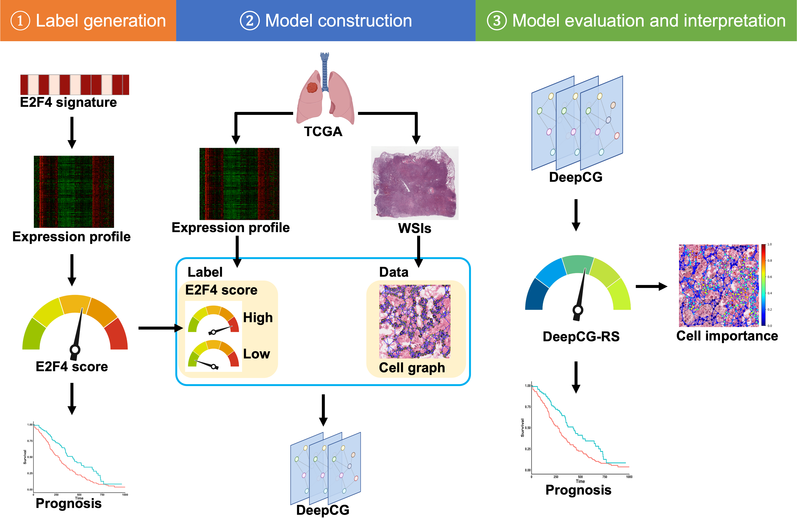

<p>
   </a>
</p>
<br>

## DeepCG: A cell graph for predicting prognosis in lung adenocarcinoma
_**Baoyi Zhang<sup>1</sup>**, Chenyang Li<sup>2</sup>, xxx xx<sup>3</sup>, Jia Wu<sup>4</sup>, xxx xx<sup>5</sup>, Chao Cheng<sup>6,*</sup>_</br></br>

### Table of Contents  
[Requirements](#requirements)  
[Overview](#overview)  
[Preprocess](#preprocess)  
[Development](#training)</br>
[Interpretation](#interpret)</br>
[Cite](#cite)  


<a name="requirements"></a>
### Requirements

* python 3.7
* numpy >= 1.21.2
* pandas >= 0.25.1
* pillow >= 8.3.1
* openslides >= 3.3
* torch >= 1.9.1
* xxx

<a name="overview"></a>
### Overview

This repository provides the codes for xxx in our [paper](https://xxx). 
```src``` souce code

<a name="preprocess"></a>
### Preprocess

* Run the ```cut_tiles.py``` to cut large whole slide images into small tiles with 512\*512 pixels. 
```
$ python ./Preprocess/cut_tiles.py 
```

* Run the ```save_graph.py``` to construct and save cell graphs for each tile.  
```
$ python ./Preprocess/save_graph.py
```

<a name="training"></a>
### Development

We used the TCGA_LUAD data as the discovery data to train and test the DeepCG model, and used CPTAC_LUAD data for independent evaluation. 
#### Discovery data
* Run the ```split.py``` to split whole data into train and test set

```
$ python ./Development/split.py
```

* Run the ```train.py``` to train the DeepCG model on TCGA training set

```
$ python ./Development/train.py --mpath <directory to save models> --lr 0.00001 --l2 0 --epoch 100
```
```mpath```: Directory to save models

```lr```: Learning rate

```l2```: L2 regularization

```epoch```: Maximum epoch

* Run the ```test.py``` to test the trained model on TCGA test set and output the model with the best performance

```
$ python ./Development/test.py --mpath <directory of saved models> 
```

```mpath```: Directory of saved models
#### Independent evaluation
* Run the ```test_CPTAC.py``` to test model performance in CPTAC data
```
$ python ./Development/test_CPTAC.py --input <directory of CPTAC cell graphs> --mpath <model path> 
```
```input```: Directory of CPTAC cell graphs

```mpath```: Path of the selected model

<a name="interpret"></a>
### Interpretation
* Run the ```interpret.py``` to save cell-level importance and cellular features for each patient
```
$ python ./Interpretation/interpret.py --input <directory of CPTAC cell graphs> --mpath <model path>  --output <directory to save importance and cellular features>
```
```input```: Directory of CPTAC cell graphs

```mpath```: Path of the selected model

```output```: Directory to save importance and cellular features

* Run the ```feature_compare.py``` to compare cellular features between important and non-important cells for each patient
```
$ python ./Interpretation/feature_compare.py
```

<a name="cite"></a>
### Cite
```bibtex
@article{
}

```
